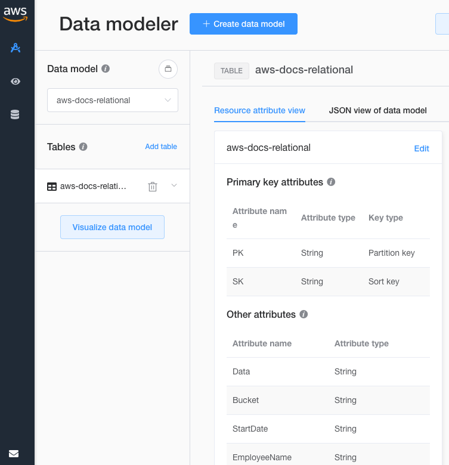
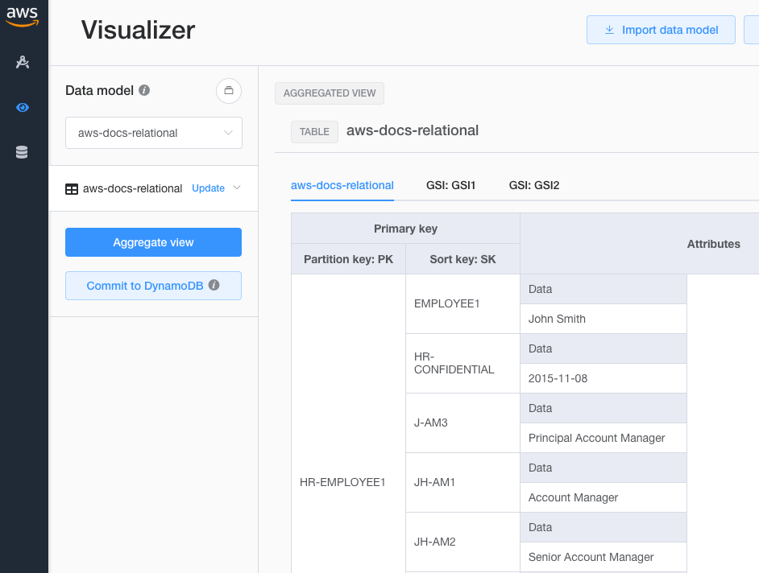
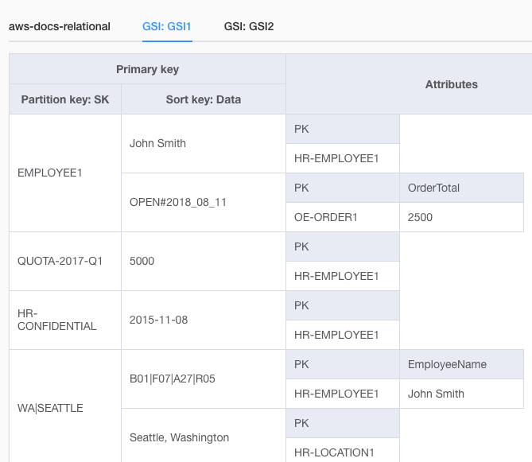
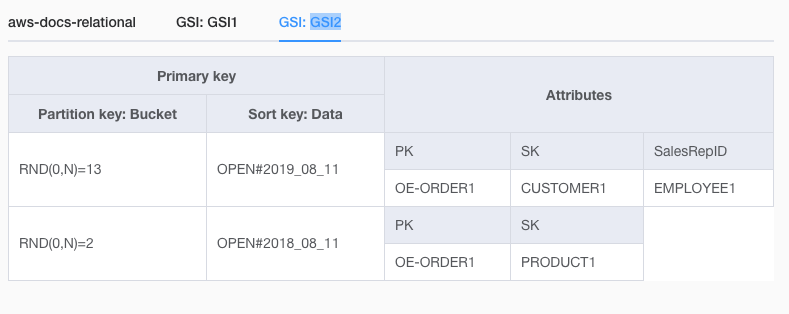

======================================================================
 NoSQL Workbench for AWS Docs on Modeling Relational Data in DynamoDB
======================================================================

I'm using the `NoSQL Workbench
<https://aws.amazon.com/about-aws/whats-new/2019/09/introducing-nosql-workbench-for-amazon-dynamodb-now-in-preview/>`_
to improve my understanding of how to model complex data with
DynamoDB. Maybe it'll be useful or fun for you to play with -- simply
import the `JSON file <aws-docs-relational.json>`_ into your Workbench.

This model implements the example in the `AWS documentation
<https://docs.aws.amazon.com/amazondynamodb/latest/developerguide/bp-modeling-nosql-B.html>`_.
It includes a Table with PK and SK, and two GSIs. The Workbench
requires creating named attributes before we can add data to the
table, so I've done that then populated the table.

The Workbench can also create a DynamoDB table in your AWS account so
you can see it "live" and run queries against it. The Workbench is
currently at version 0.2.0 so I expect it will grow many features as
it evolves; should be fun to watch.

Here's the top of the data model, with the PK, SK, and GSI keys
defined, and the start of other attributes:

After using the Add and Edit features, this is some of the data in the Table:

And the first part of the GSI1 view:

And finally a view of the sparse index on the shard ``Bucket`` in
GSI2; note that I set values for the random Bucket so that we could
see two distinct rows:

The eagle-eyed reader may note that GSI2 has SalesRepID=EMPLOYEE1
here, while the AWS docs have EMPLOYEE2. I believe my model is correct
and have submitted feedback on the docs.
